# FlashMind AI — Architecture Documentation

# System Overview

FlashMind AI is a React-based educational web application that combines traditional flashcard management with AI-powered tutoring and voice-assisted learning.

The architecture follows a frontend-centric design where:

- React handles UI rendering
- Supabase handles persistence
- Groq handles AI tutoring
- Browser Speech Synthesis handles voice explanations
- Vercel handles deployment

---

# High Level System Architecture

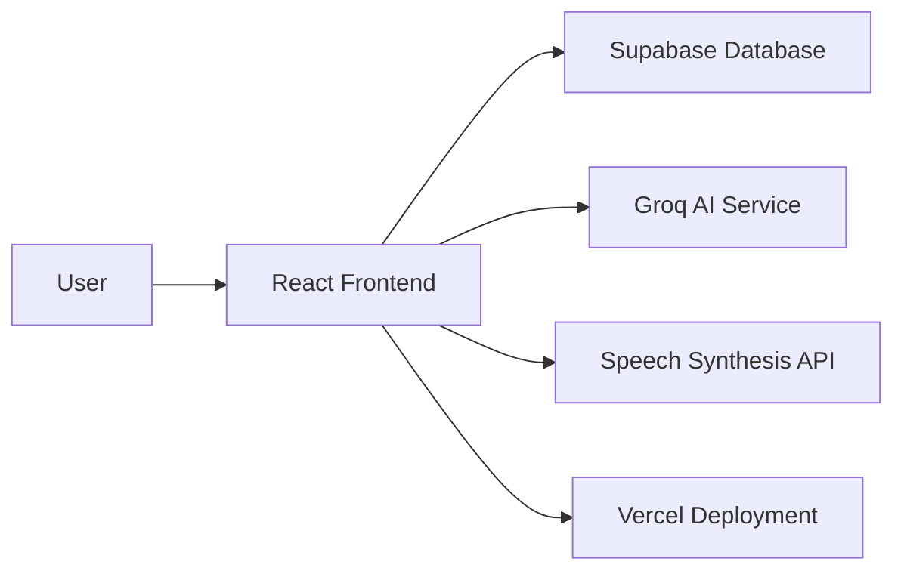

---

# Application Layer Architecture

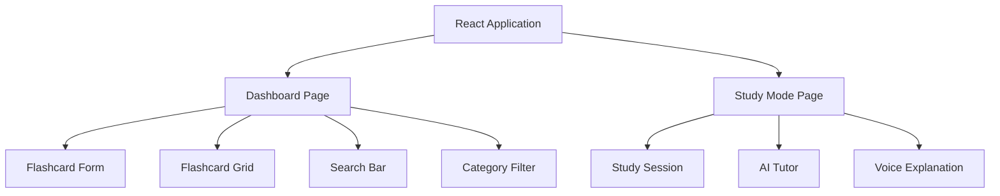

---

# Frontend Component Hierarchy

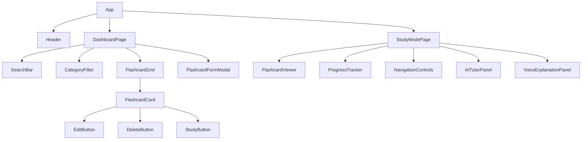

---

# Database Architecture

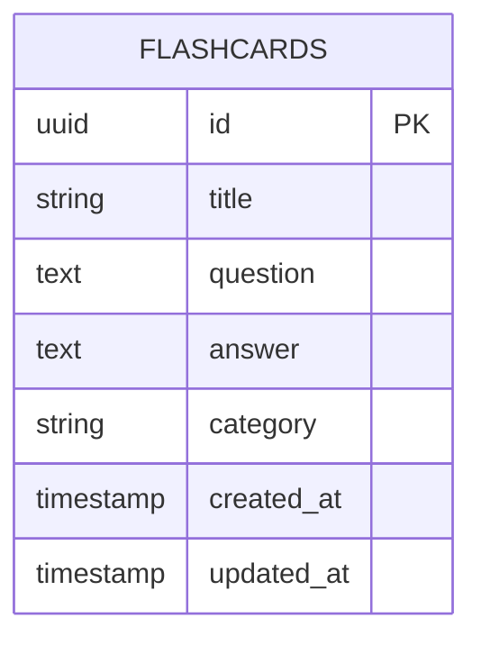

---

# Database CRUD Flow

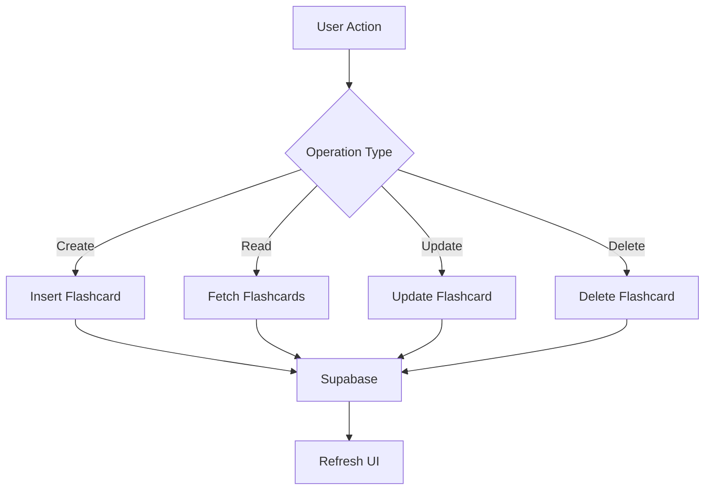

---

# Flashcard Creation Flow

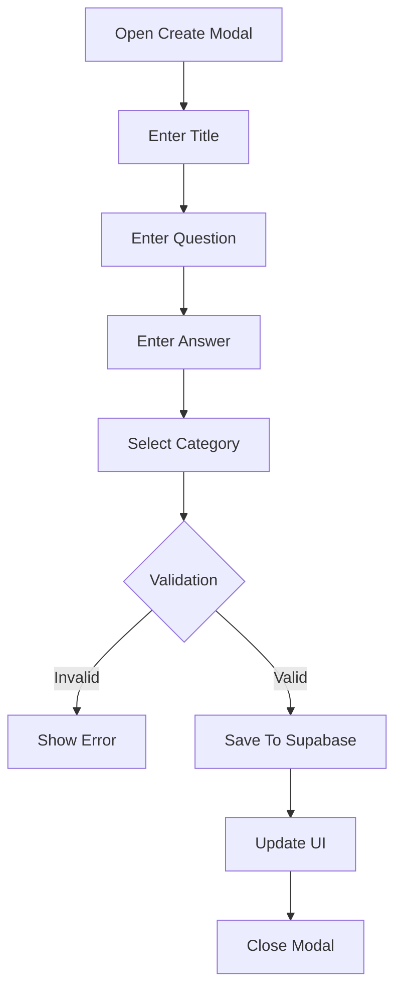

---

# Flashcard Editing Flow

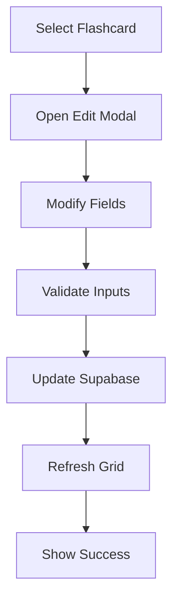

---

# Flashcard Deletion Flow

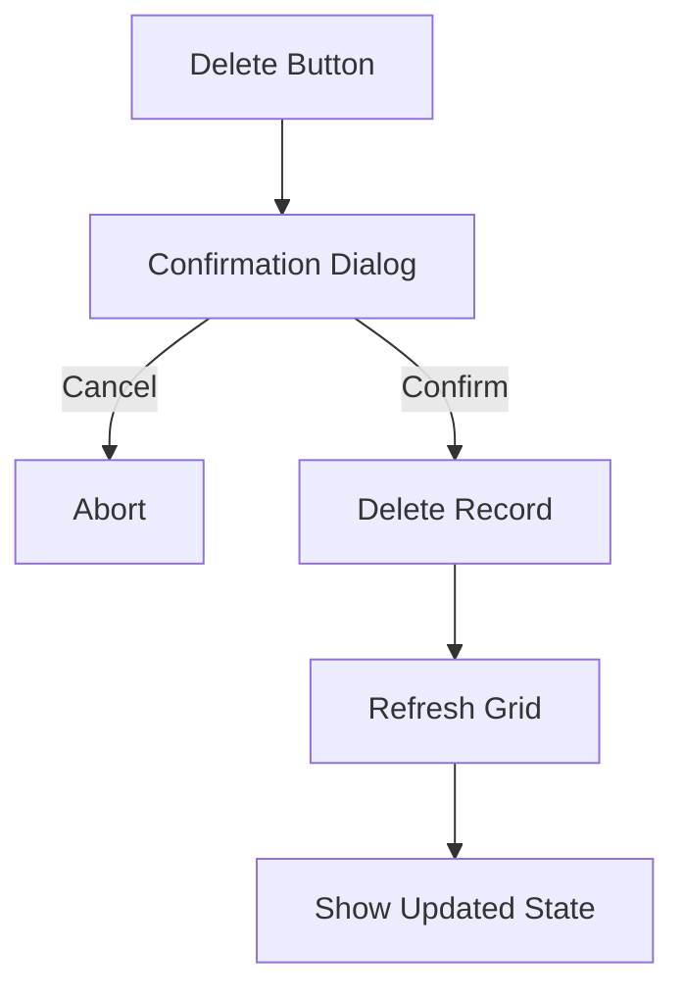

---

# Search Architecture

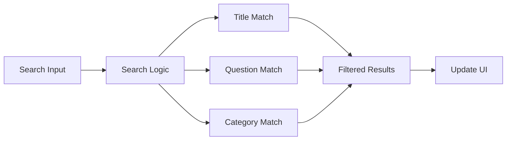

---

# Category Filter Flow

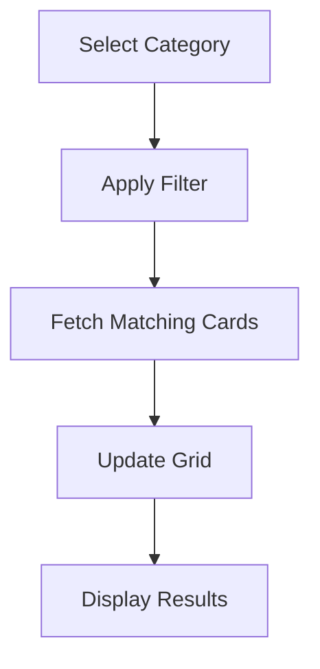

---

# Study Mode Architecture

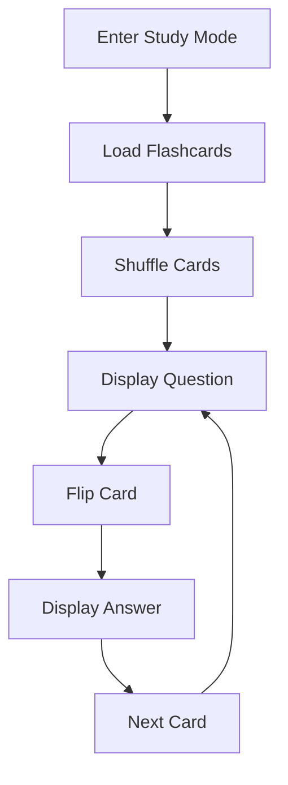

---

# Study Session State Flow

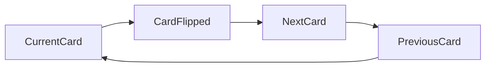

---

# AI Tutor Architecture

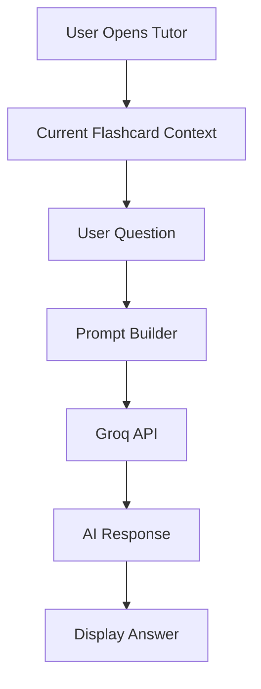

---

# Context-Locked AI Flow

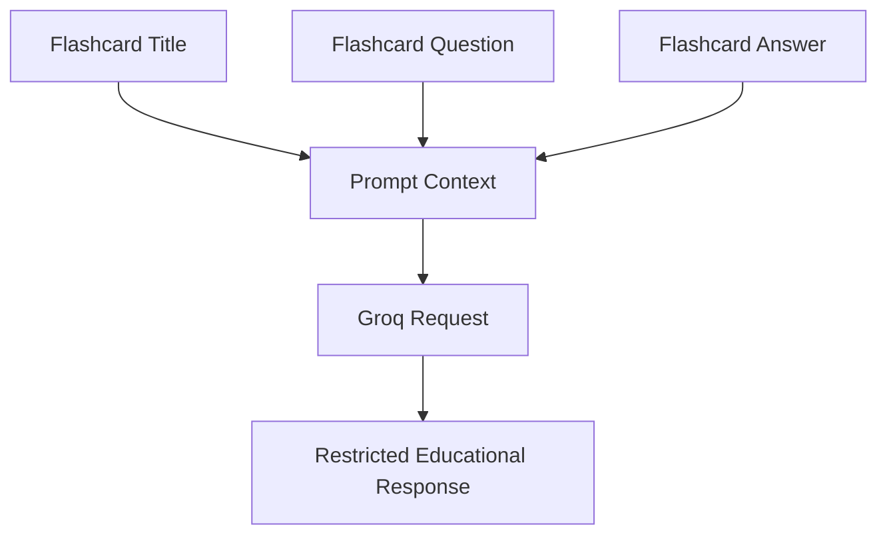

---

# Voice Explanation Architecture

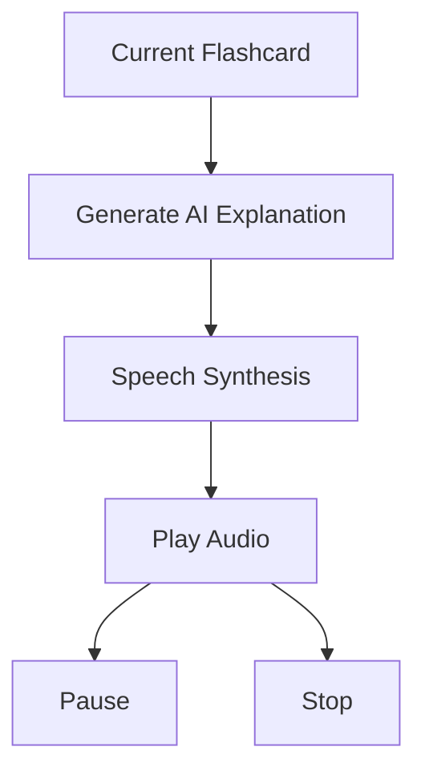

---

# AI + Voice Combined Flow

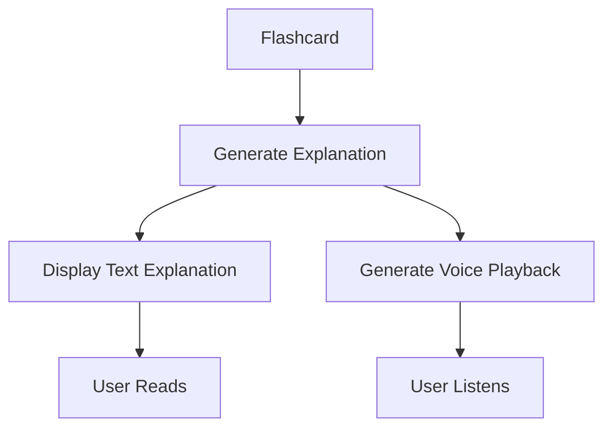

---

# Validation Architecture

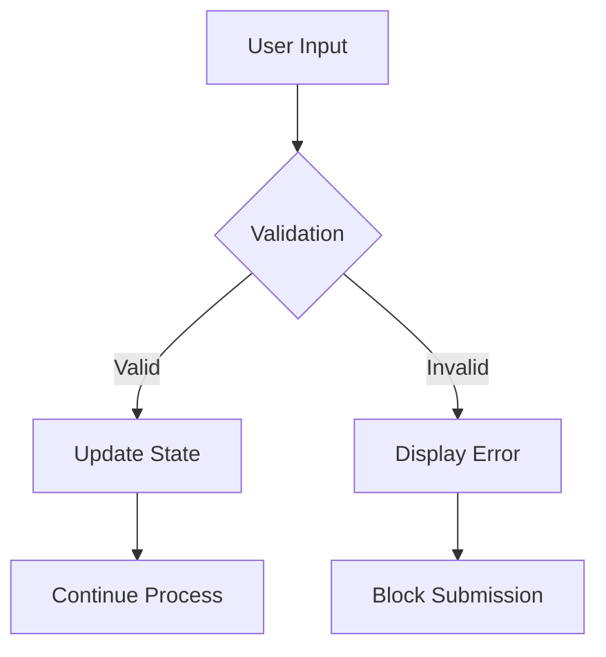

---

# Error Handling Architecture

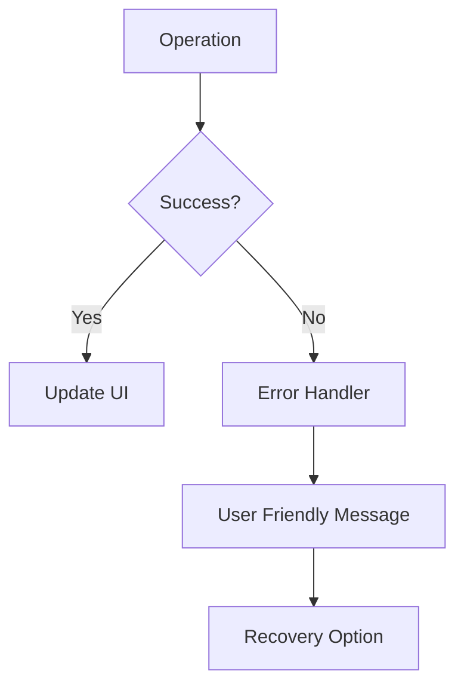

---

# Loading State Architecture

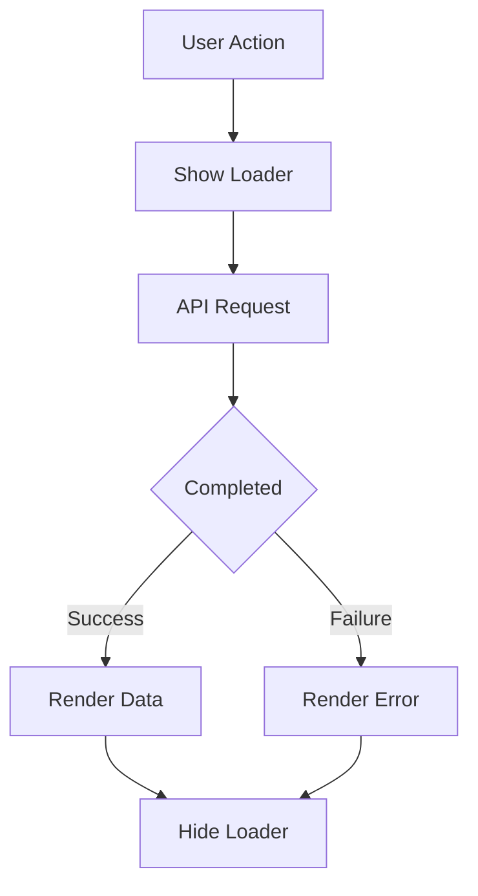

---

# Environment Configuration Architecture

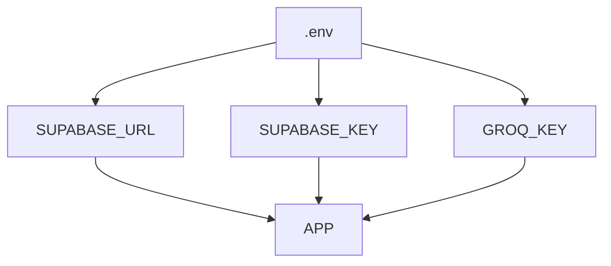

---

# Deployment Architecture

```mermaid
flowchart LR

Developer

Developer --> GitHub

GitHub --> Vercel

Vercel --> ReactApp

ReactApp --> Supabase

ReactApp --> Groq
```

---

# Production Data Flow

```mermaid
flowchart TD

User

User --> ReactFrontend

ReactFrontend --> Supabase

ReactFrontend --> Groq

Groq --> ReactFrontend

Supabase --> ReactFrontend

ReactFrontend --> User
```

---

# Folder Structure Architecture

```txt
flashmind-ai/

├── src/
│
├── components/
│   ├── Header/
│   ├── FlashcardForm/
│   ├── FlashcardGrid/
│   ├── FlashcardCard/
│   ├── SearchBar/
│   ├── CategoryFilter/
│   ├── StudyMode/
│   ├── AITutor/
│   └── VoiceExplanation/
│
├── pages/
│   ├── Dashboard/
│   └── StudyMode/
│
├── services/
│   ├── supabase.js
│   └── groq.js
│
├── hooks/
│
├── utils/
│
├── docs/
│
├── README.md
├── ANSWERS.md
└── package.json
```

---

# Architecture Principles

The architecture is designed around the following principles:

### Simplicity

Avoid unnecessary complexity.

### Maintainability

Keep components modular and reusable.

### Scalability

Allow future feature expansion without major rewrites.

### Responsiveness

Provide a consistent experience across devices.

### Accessibility

Support keyboard navigation and inclusive interactions.

### Reliability

Handle failures gracefully and preserve user data.

---

# Definition Of Architectural Success

The architecture is considered successful if:

- CRUD operations work reliably
- Data persists correctly
- Search performs efficiently
- Study mode remains intuitive
- AI tutor stays context-aware
- Voice explanations function consistently
- UI remains responsive
- Deployment works without modification
- Future features can be added cleanly

```

```
