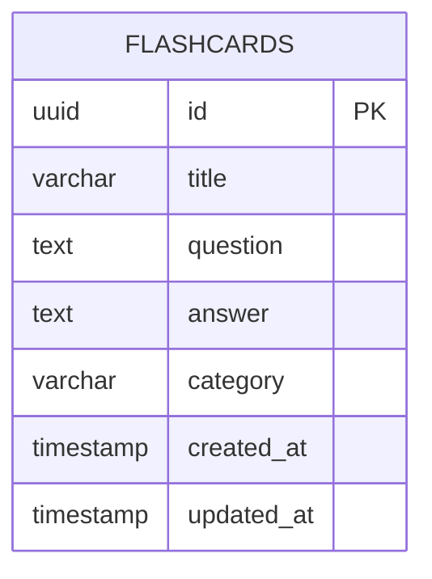
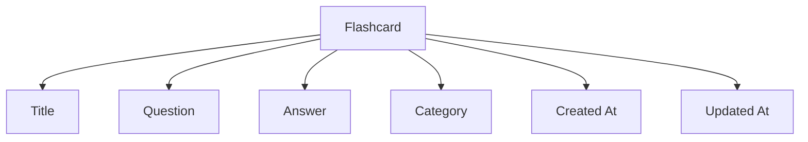
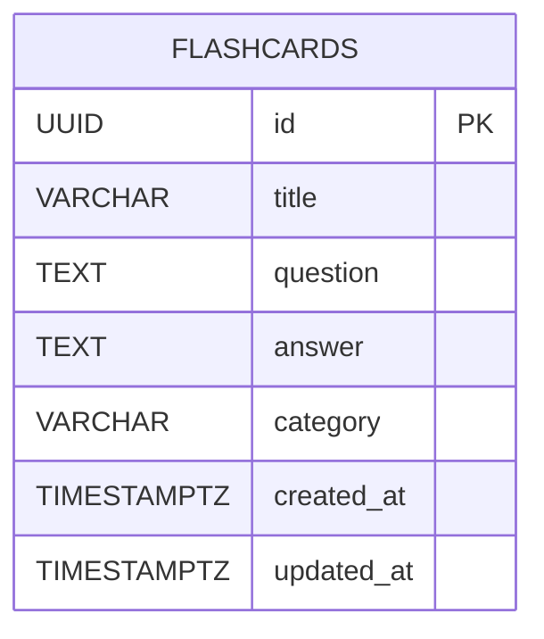
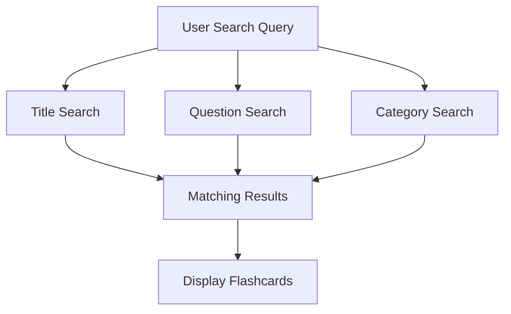
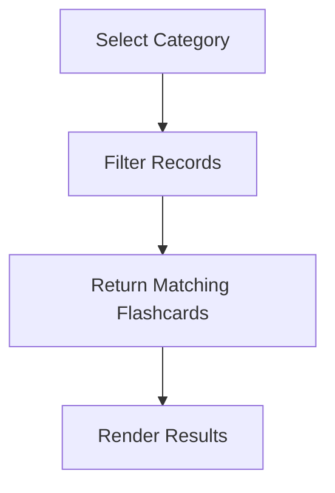
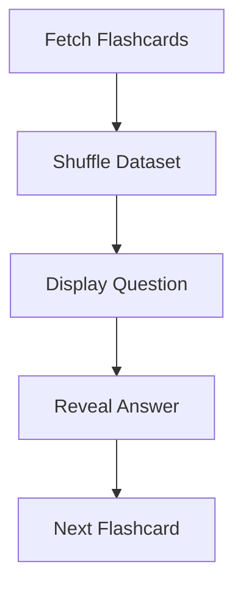
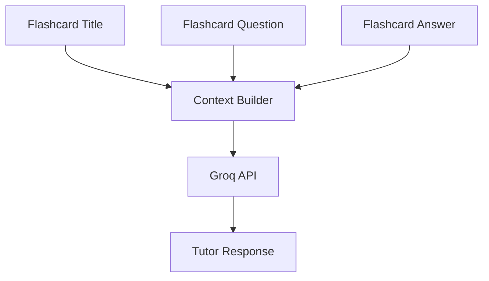
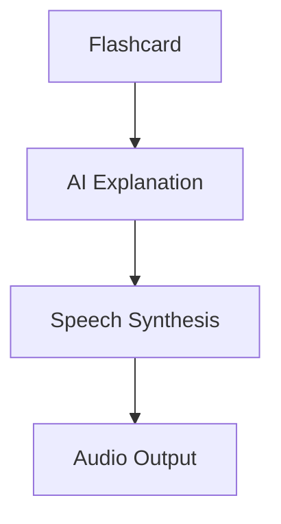

# FlashMind AI — Database Schema Documentation

# Purpose

This document defines the database schema used by FlashMind AI.

The goal of this schema is to:

* support CRUD operations
* enable persistent storage
* remain simple and maintainable
* satisfy assessment requirements
* support future scalability

---

# Database Technology

Database Provider:

Supabase

Database Engine:

PostgreSQL

---

# Design Philosophy

The project intentionally uses a minimal schema.

Reasons:

* assessment scope remains focused
* easier maintenance
* fewer failure points
* faster implementation
* simpler testing

The application currently requires only one primary table:

```txt
flashcards
```

All additional functionality:

* search
* filtering
* study mode
* AI tutoring
* voice explanations

operates on flashcard data and does not require additional persistence.

---

# Entity Relationship Diagram (High Level)



---

# Logical Data Model



---

# Table Structure

## flashcards

Stores all flashcard records created by users.

---

### id

Type:

```sql
UUID
```

Purpose:

Unique identifier for each flashcard.

Properties:

* Primary Key
* Auto Generated

---

### title

Type:

```sql
VARCHAR(150)
```

Purpose:

Short flashcard title.

Example:

```txt
Gradient Descent
```

Validation:

* Required
* Max Length 150

---

### question

Type:

```sql
TEXT
```

Purpose:

Question shown to the learner.

Example:

```txt
What is Gradient Descent?
```

Validation:

* Required

---

### answer

Type:

```sql
TEXT
```

Purpose:

Answer revealed during study mode.

Validation:

* Required

---

### category

Type:

```sql
VARCHAR(100)
```

Purpose:

Flashcard grouping.

Examples:

* AI
* Programming
* Mathematics
* Science
* Custom

Validation:

* Required

---

### created_at

Type:

```sql
TIMESTAMP WITH TIME ZONE
```

Purpose:

Stores creation time.

Auto generated.

---

### updated_at

Type:

```sql
TIMESTAMP WITH TIME ZONE
```

Purpose:

Stores last modification time.

Auto updated.

---

# Physical Database Schema



---

# SQL Schema

```sql
CREATE TABLE flashcards (

id UUID PRIMARY KEY DEFAULT gen_random_uuid(),

title VARCHAR(150) NOT NULL,

question TEXT NOT NULL,

answer TEXT NOT NULL,

category VARCHAR(100) NOT NULL,

created_at TIMESTAMPTZ DEFAULT NOW(),

updated_at TIMESTAMPTZ DEFAULT NOW()

);
```

---

# Update Timestamp Trigger

Purpose:

Automatically update the updated_at field whenever a flashcard changes.

---

## Trigger Function

```sql
CREATE OR REPLACE FUNCTION update_updated_at_column()

RETURNS TRIGGER AS $$

BEGIN

NEW.updated_at = NOW();

RETURN NEW;

END;

$$ LANGUAGE plpgsql;
```

---

## Trigger

```sql
CREATE TRIGGER update_flashcards_updated_at

BEFORE UPDATE

ON flashcards

FOR EACH ROW

EXECUTE FUNCTION update_updated_at_column();
```

---

# Recommended Indexes

Purpose:

Improve search performance.

---

## Title Index

```sql
CREATE INDEX idx_flashcards_title

ON flashcards(title);
```

---

## Category Index

```sql
CREATE INDEX idx_flashcards_category

ON flashcards(category);
```

---

# CRUD Mapping

## Create

```sql
INSERT
```

Creates new flashcard.

---

## Read

```sql
SELECT
```

Retrieves flashcards.

---

## Update

```sql
UPDATE
```

Modifies flashcards.

---

## Delete

```sql
DELETE
```

Removes flashcards.

---

# Search Flow Mapping



---

# Category Filtering Mapping



---

# Study Mode Data Flow



---

# AI Tutor Context Flow

The AI Tutor does not store conversations.

Context is generated dynamically.



---

# Voice Explanation Flow

Voice explanations are generated dynamically.

No audio data is stored.



---

# Validation Constraints

Application Layer Validation:

### Title

* Required
* Max 150 Characters

### Question

* Required

### Answer

* Required

### Category

* Required

---

# Future Expansion Possibilities

The current schema intentionally avoids unnecessary complexity.

Potential future tables:

```txt
study_sessions
ai_conversations
user_preferences
bookmarks
```

These are excluded from the current implementation to keep the project aligned with the assessment scope.

---

# Schema Success Criteria

The schema is considered successful if:

* CRUD operations work correctly
* Flashcards persist across sessions
* Search performs efficiently
* Categories filter correctly
* Study mode functions properly
* AI tutor receives valid flashcard context
* Voice explanations operate without stored data
* The database remains simple and maintainable

```

```
