# FlashMind AI — User Flow Documentation

# Purpose

This document defines how users interact with FlashMind AI.

The goal is to ensure:

- predictable user behavior
- smooth navigation
- consistent interactions
- proper validation
- intuitive study experience

The user flows defined here will guide implementation, testing, UI design, and future improvements.

---

# Primary User Journey

This is the main expected flow of the application.

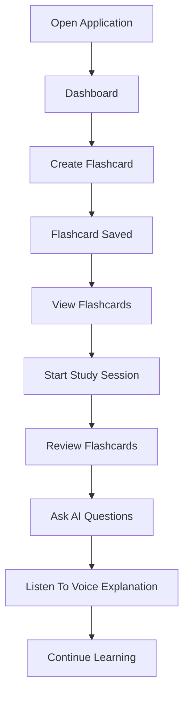
```mermaid
flowchart TD

A[Open Application]

A --> B[Dashboard]

B --> C[Create Flashcard]

C --> D[Flashcard Saved]

D --> E[View Flashcards]

E --> F[Start Study Session]

F --> G[Review Flashcards]

G --> H[Ask AI Questions]

H --> I[Listen To Voice Explanation]

I --> J[Continue Learning]
```

---

# Dashboard Flow

The dashboard acts as the central hub.

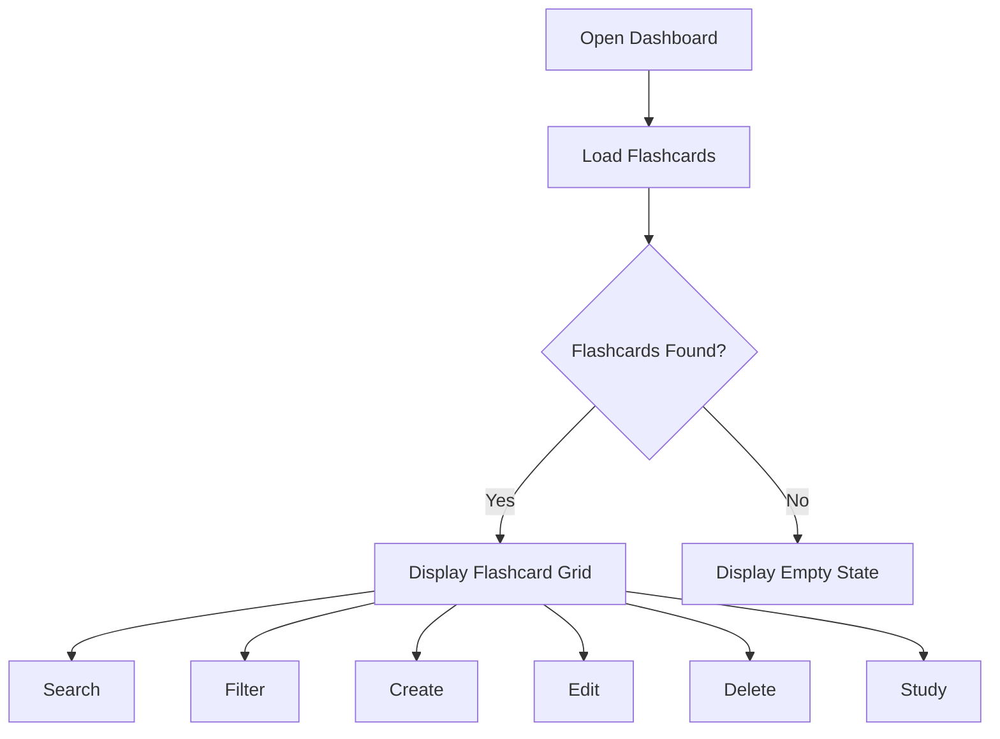
```mermaid
flowchart TD

A[Open Dashboard]

A --> B[Load Flashcards]

B --> C{Flashcards Found?}

C -->|Yes| D[Display Flashcard Grid]

C -->|No| E[Display Empty State]

D --> F[Search]

D --> G[Filter]

D --> H[Create]

D --> I[Edit]

D --> J[Delete]

D --> K[Study]
```

---

# Create Flashcard Flow

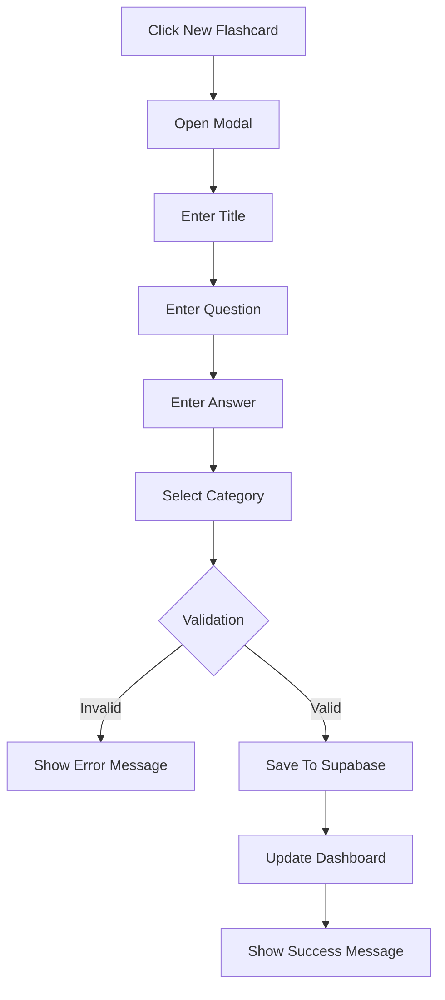
```mermaid
flowchart TD

A[Click New Flashcard]

A --> B[Open Modal]

B --> C[Enter Title]

C --> D[Enter Question]

D --> E[Enter Answer]

E --> F[Select Category]

F --> G{Validation}

G -->|Invalid| H[Show Error Message]

G -->|Valid| I[Save To Supabase]

I --> J[Update Dashboard]

J --> K[Show Success Message]
```

---

# Create Flashcard Validation Flow

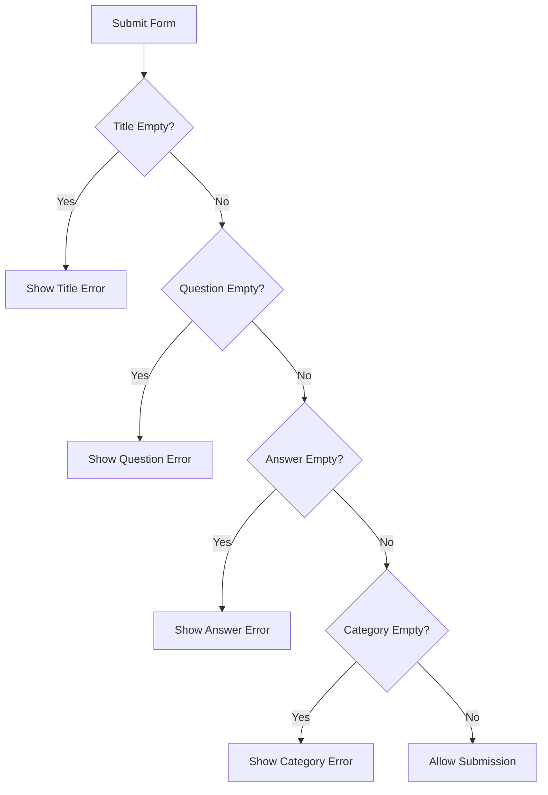
```mermaid
flowchart TD

A[Submit Form]

A --> B{Title Empty?}

B -->|Yes| C[Show Title Error]

B -->|No| D{Question Empty?}

D -->|Yes| E[Show Question Error]

D -->|No| F{Answer Empty?}

F -->|Yes| G[Show Answer Error]

F -->|No| H{Category Empty?}

H -->|Yes| I[Show Category Error]

H -->|No| J[Allow Submission]
```

---

# Edit Flashcard Flow

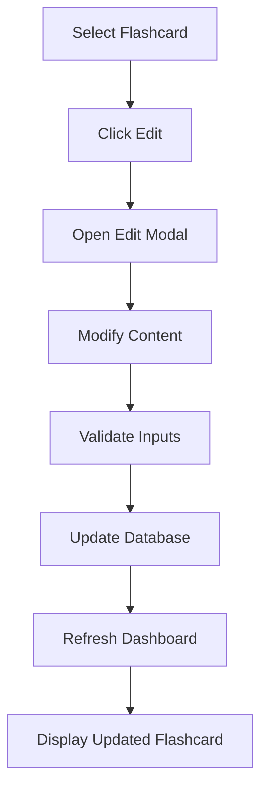
```mermaid
flowchart TD

A[Select Flashcard]

A --> B[Click Edit]

B --> C[Open Edit Modal]

C --> D[Modify Content]

D --> E[Validate Inputs]

E --> F[Update Database]

F --> G[Refresh Dashboard]

G --> H[Display Updated Flashcard]
```

---

# Delete Flashcard Flow

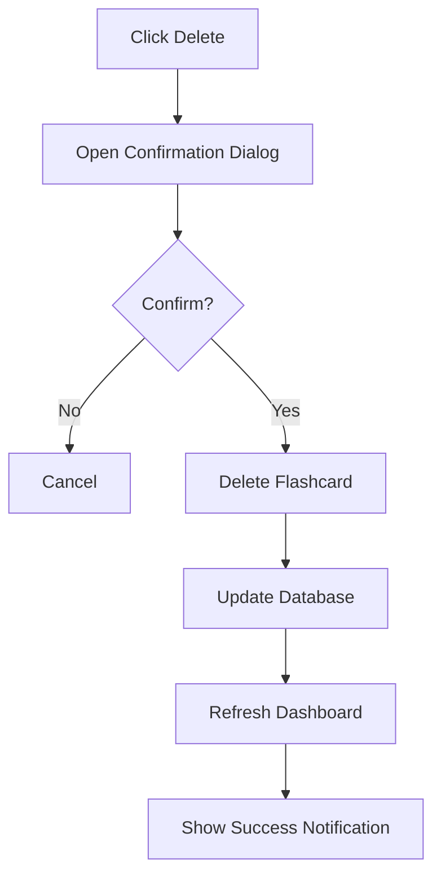
```mermaid
flowchart TD

A[Click Delete]

A --> B[Open Confirmation Dialog]

B --> C{Confirm?}

C -->|No| D[Cancel]

C -->|Yes| E[Delete Flashcard]

E --> F[Update Database]

F --> G[Refresh Dashboard]

G --> H[Show Success Notification]
```

---

# Search Flow

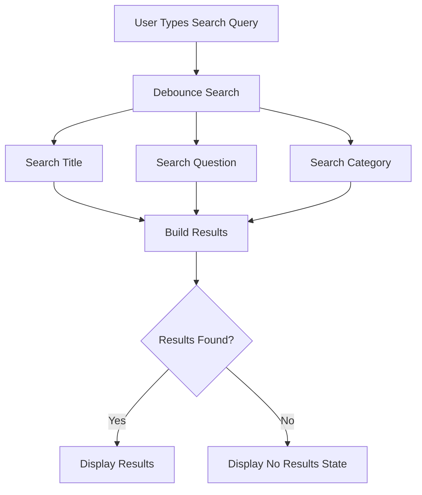
```mermaid
flowchart TD

A[User Types Search Query]

A --> B[Debounce Search]

B --> C[Search Title]

B --> D[Search Question]

B --> E[Search Category]

C --> F[Build Results]

D --> F

E --> F

F --> G{Results Found?}

G -->|Yes| H[Display Results]

G -->|No| I[Display No Results State]
```

---

# Category Filter Flow

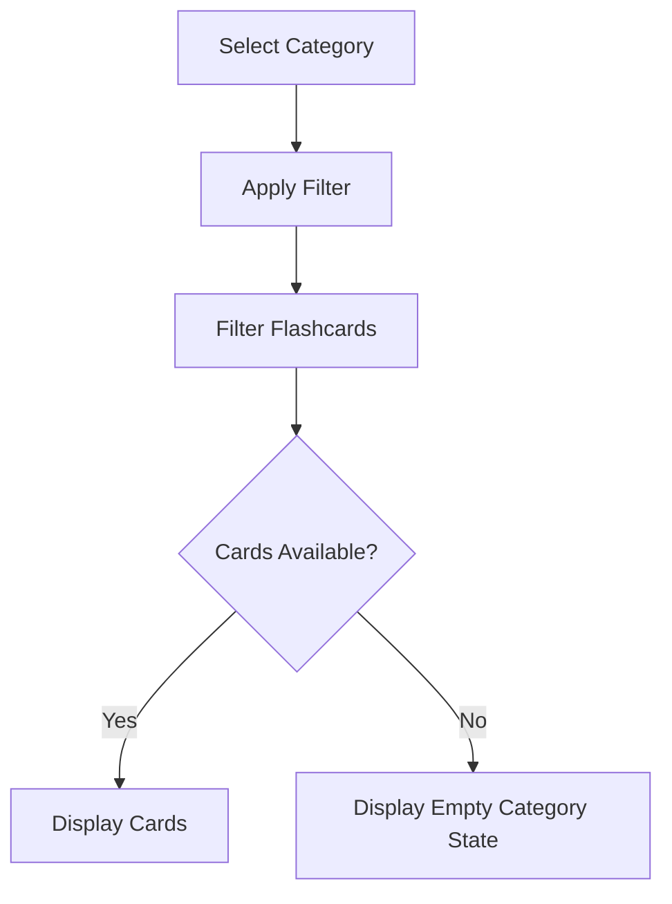
```mermaid
flowchart TD

A[Select Category]

A --> B[Apply Filter]

B --> C[Filter Flashcards]

C --> D{Cards Available?}

D -->|Yes| E[Display Cards]

D -->|No| F[Display Empty Category State]
```

---

# Study Mode Entry Flow

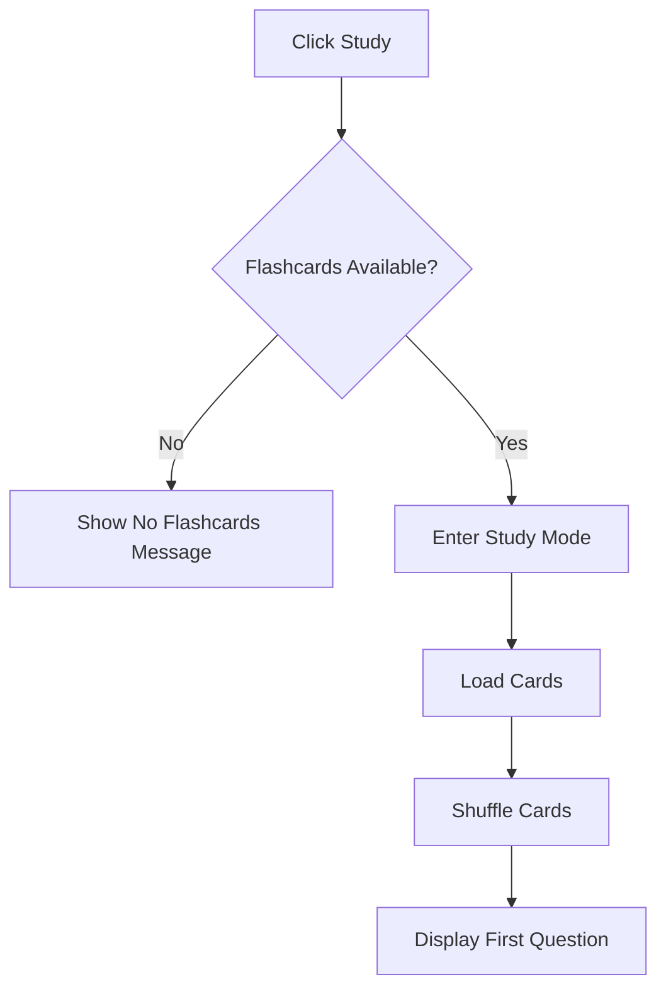
```mermaid
flowchart TD

A[Click Study]

A --> B{Flashcards Available?}

B -->|No| C[Show No Flashcards Message]

B -->|Yes| D[Enter Study Mode]

D --> E[Load Cards]

E --> F[Shuffle Cards]

F --> G[Display First Question]
```

---

# Study Session Flow

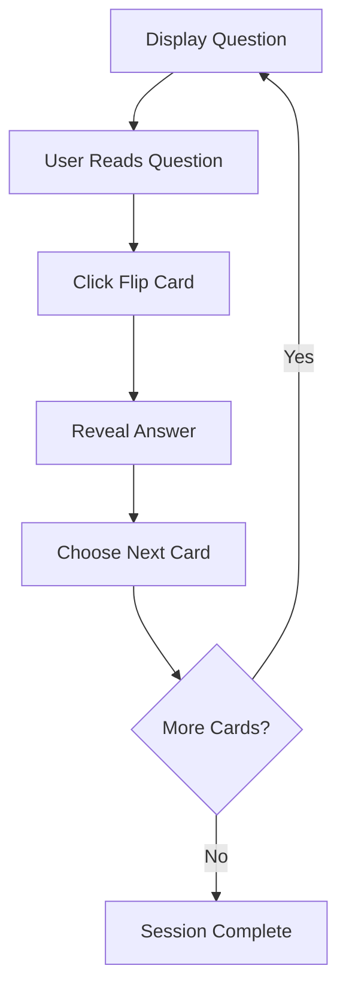
```mermaid
flowchart TD

A[Display Question]

A --> B[User Reads Question]

B --> C[Click Flip Card]

C --> D[Reveal Answer]

D --> E[Choose Next Card]

E --> F{More Cards?}

F -->|Yes| A

F -->|No| G[Session Complete]
```

---

# Study Session Navigation Flow

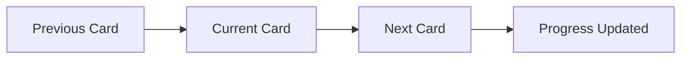
```mermaid
flowchart LR

A[Previous Card]

A --> B[Current Card]

B --> C[Next Card]

C --> D[Progress Updated]
```

---

# AI Tutor Flow

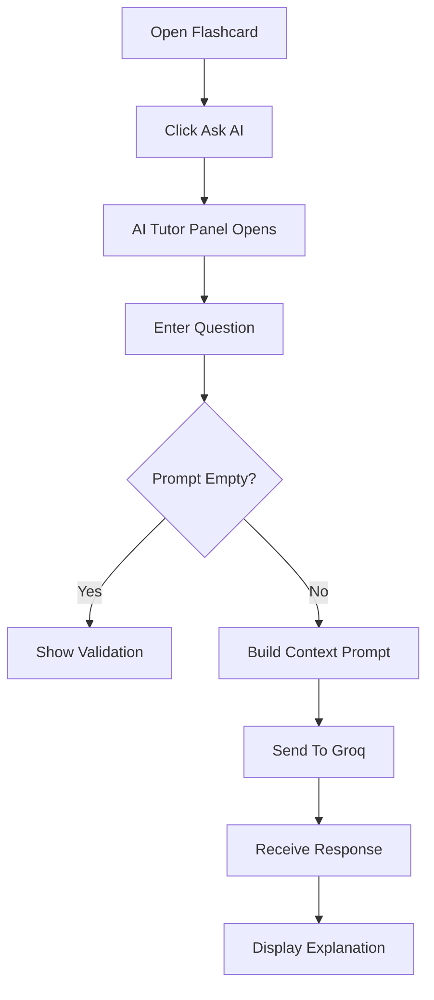
```mermaid
flowchart TD

A[Open Flashcard]

A --> B[Click Ask AI]

B --> C[AI Tutor Panel Opens]

C --> D[Enter Question]

D --> E{Prompt Empty?}

E -->|Yes| F[Show Validation]

E -->|No| G[Build Context Prompt]

G --> H[Send To Groq]

H --> I[Receive Response]

I --> J[Display Explanation]
```

---

# Context-Locked AI Flow

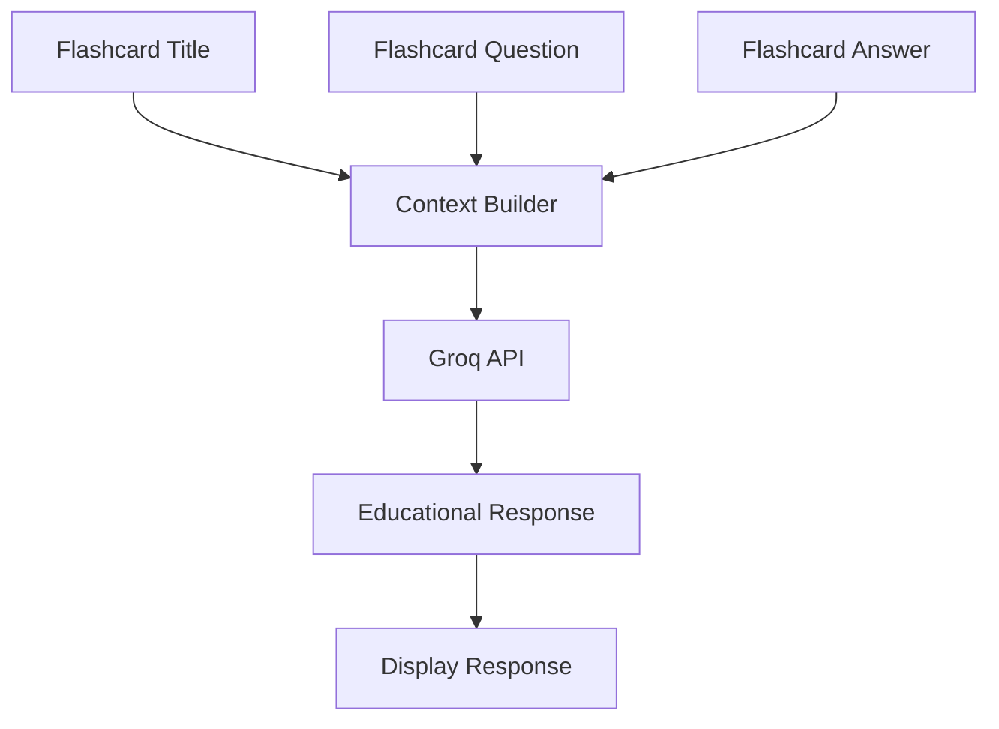
```mermaid
flowchart TD

A[Flashcard Title]

B[Flashcard Question]

C[Flashcard Answer]

A --> D[Context Builder]

B --> D

C --> D

D --> E[Groq API]

E --> F[Educational Response]

F --> G[Display Response]
```

---

# Voice Explanation Flow

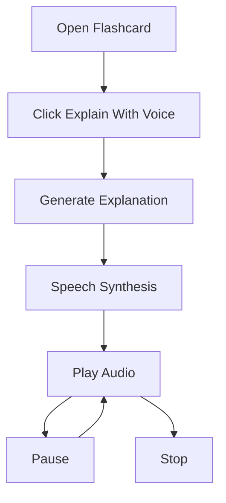
```mermaid
flowchart TD

A[Open Flashcard]

A --> B[Click Explain With Voice]

B --> C[Generate Explanation]

C --> D[Speech Synthesis]

D --> E[Play Audio]

E --> F[Pause]

E --> G[Stop]

F --> E
```

---

# Voice Validation Flow

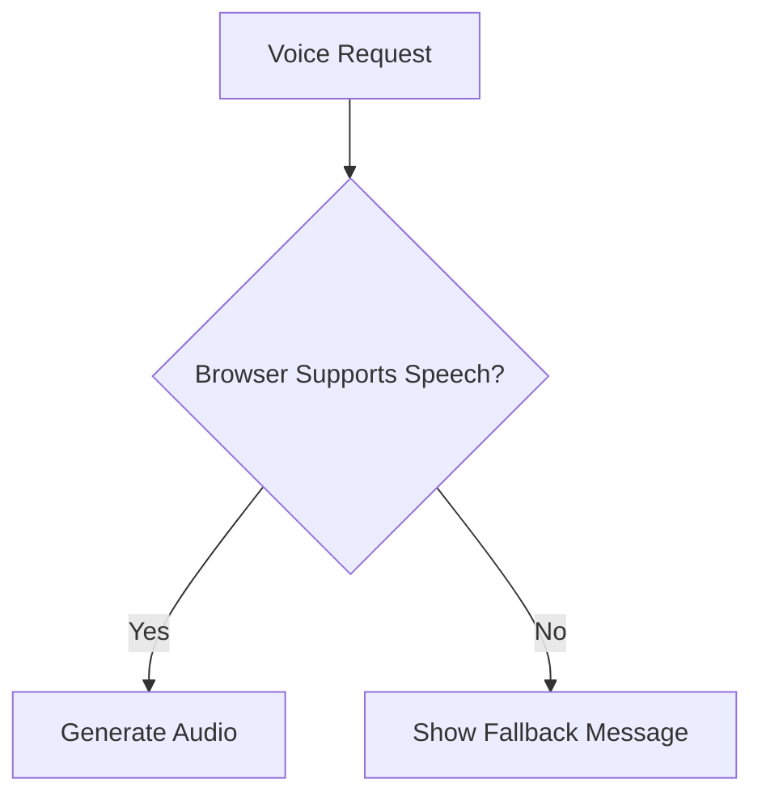
```mermaid
flowchart TD

A[Voice Request]

A --> B{Browser Supports Speech?}

B -->|Yes| C[Generate Audio]

B -->|No| D[Show Fallback Message]
```

---

# Empty State Flow

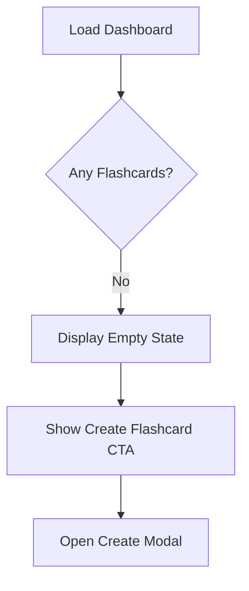
```mermaid
flowchart TD

A[Load Dashboard]

A --> B{Any Flashcards?}

B -->|No| C[Display Empty State]

C --> D[Show Create Flashcard CTA]

D --> E[Open Create Modal]
```

---

# Loading State Flow

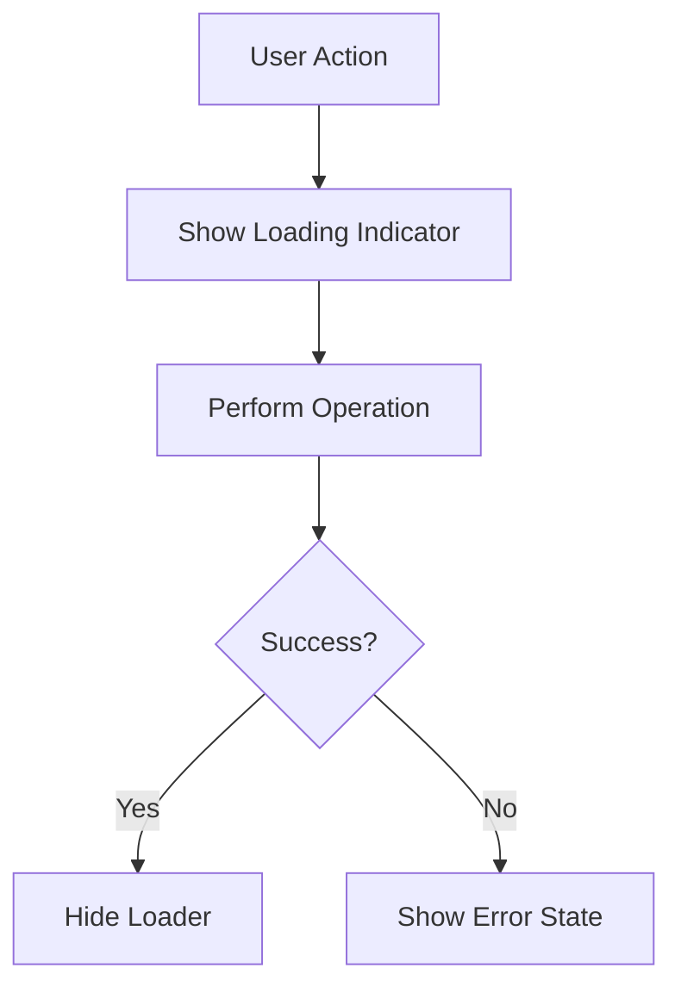
```mermaid
flowchart TD

A[User Action]

A --> B[Show Loading Indicator]

B --> C[Perform Operation]

C --> D{Success?}

D -->|Yes| E[Hide Loader]

D -->|No| F[Show Error State]
```

---

# Database Error Flow

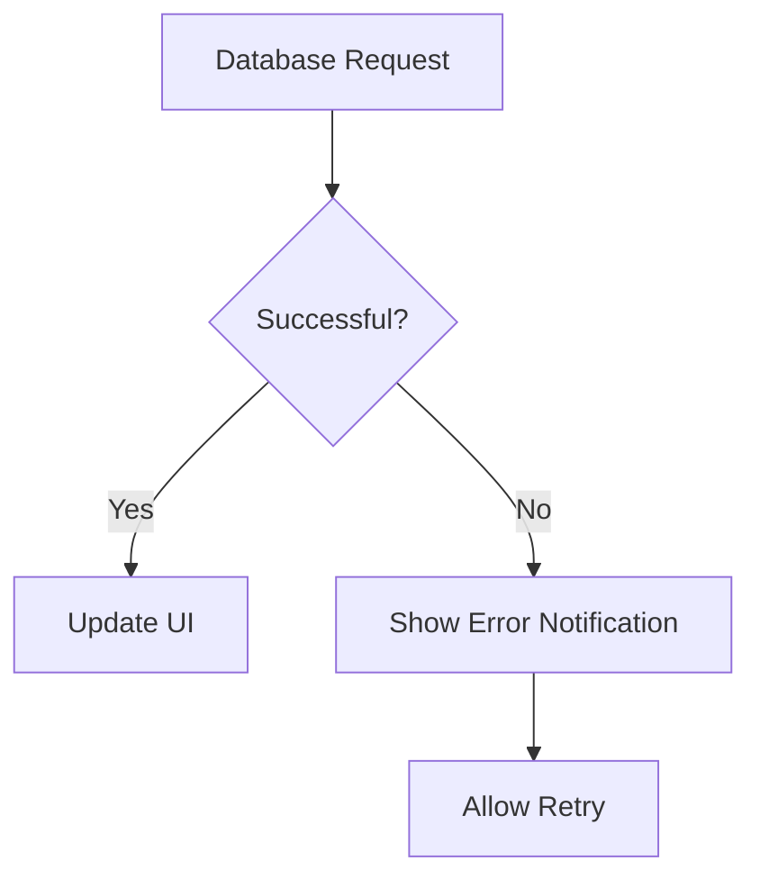
```mermaid
flowchart TD

A[Database Request]

A --> B{Successful?}

B -->|Yes| C[Update UI]

B -->|No| D[Show Error Notification]

D --> E[Allow Retry]
```

---

# AI Error Flow

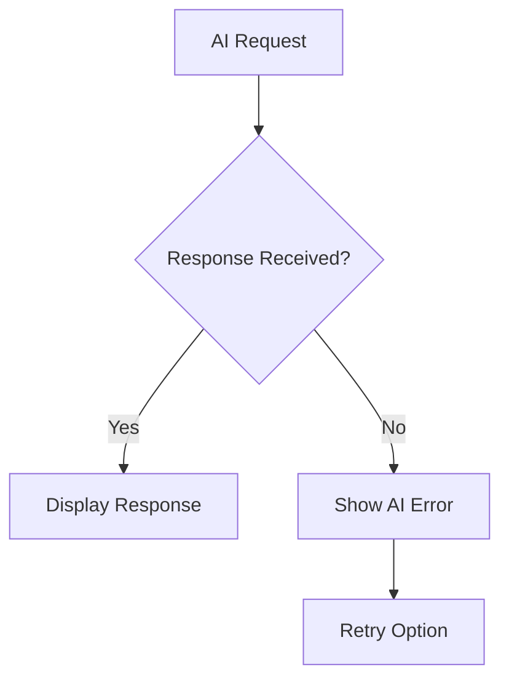
```mermaid
flowchart TD

A[AI Request]

A --> B{Response Received?}

B -->|Yes| C[Display Response]

B -->|No| D[Show AI Error]

D --> E[Retry Option]
```

---

# Mobile User Flow

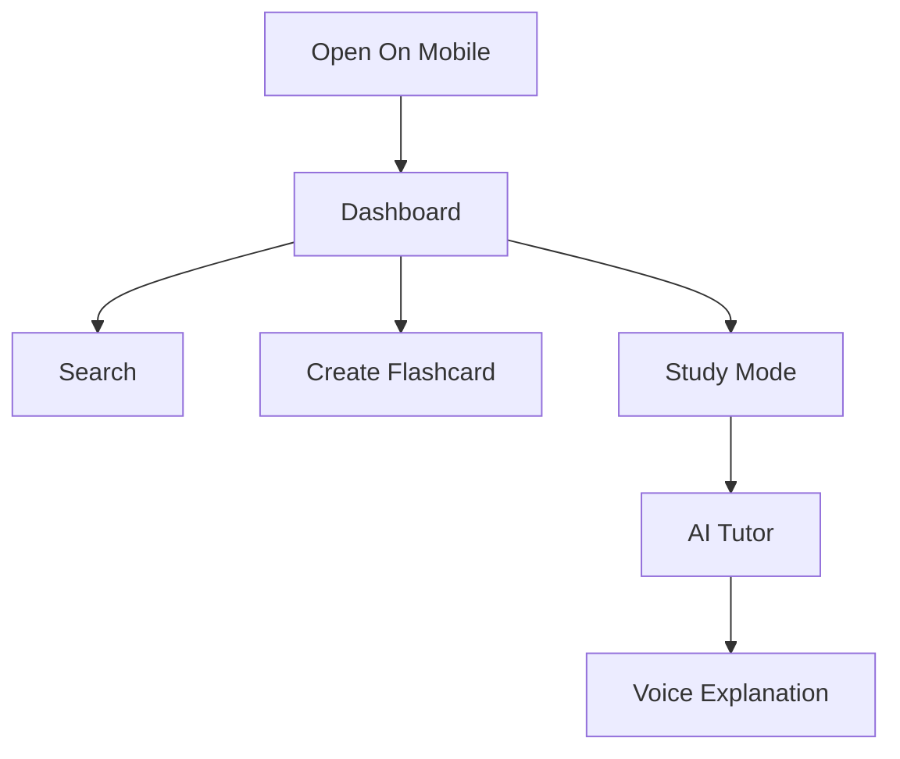
```mermaid
flowchart TD

A[Open On Mobile]

A --> B[Dashboard]

B --> C[Search]

B --> D[Create Flashcard]

B --> E[Study Mode]

E --> F[AI Tutor]

F --> G[Voice Explanation]
```

---

# Responsive Behavior Flow

```mermaid
flowchart TD

A[Application Load]

A --> B{Screen Size}

B -->|Mobile| C[Single Column Layout]

B -->|Tablet| D[Responsive Grid]

B -->|Desktop| E[Multi Column Layout]
```

---

# Complete Learning Flow

This represents the ideal learning journey.

```mermaid
flowchart TD

A[Create Flashcard]

A --> B[Store In Database]

B --> C[Review Flashcard]

C --> D[Study Mode]

D --> E[Flip Card]

E --> F[Understand Concept]

F --> G[Ask AI Tutor]

G --> H[Receive Detailed Explanation]

H --> I[Listen To Voice Explanation]

I --> J[Improve Understanding]

J --> K[Continue Learning]
```

---

# Accessibility User Flow

```mermaid
flowchart TD

A[Keyboard User]

A --> B[Navigate Dashboard]

B --> C[Open Modal]

C --> D[Fill Form]

D --> E[Submit Flashcard]

E --> F[Start Study Session]

F --> G[Use AI Tutor]

G --> H[Complete Workflow Without Mouse]
```

---

# User Experience Goals

The user experience should always feel:

- intuitive
- responsive
- educational
- distraction-free
- beginner-friendly
- accessible

Users should be able to:

- create flashcards quickly
- study efficiently
- ask meaningful questions
- receive useful explanations
- continue learning without friction

---

# User Flow Success Criteria

User flows are considered successful if:

- CRUD actions require minimal effort
- validation is clear and immediate
- search feels responsive
- study sessions feel smooth
- AI tutoring feels relevant
- voice explanations work reliably
- mobile experience remains intuitive
- no interaction leads to a dead-end state

```

```
